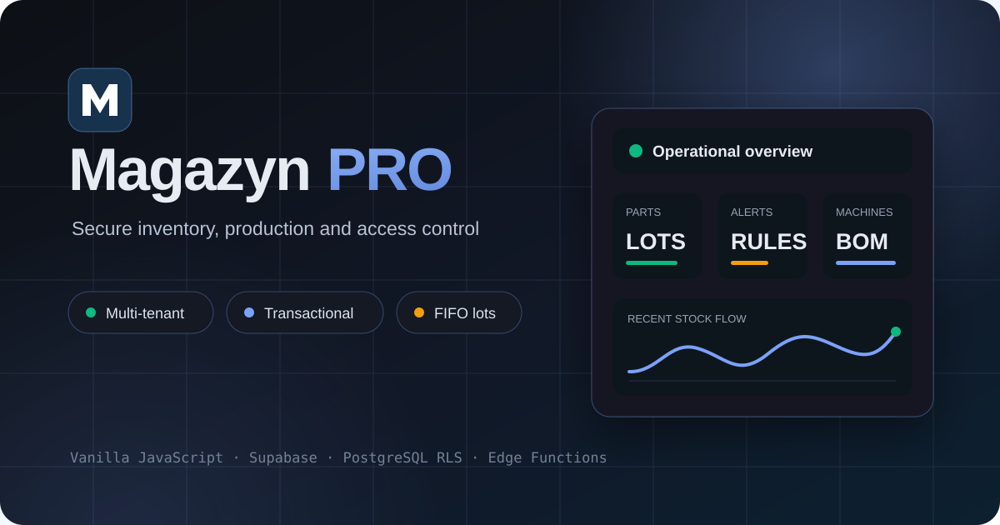
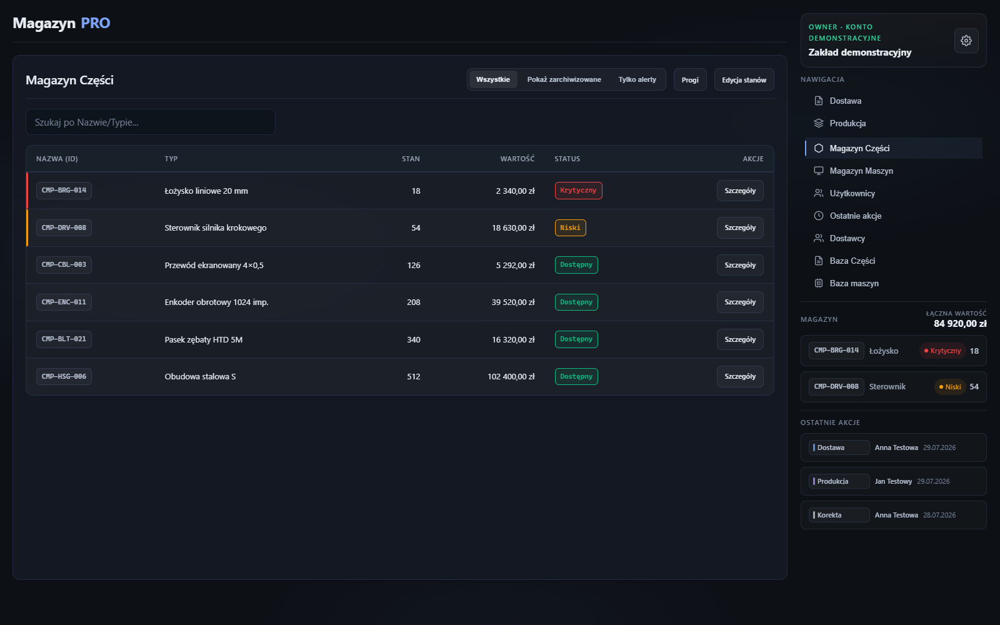
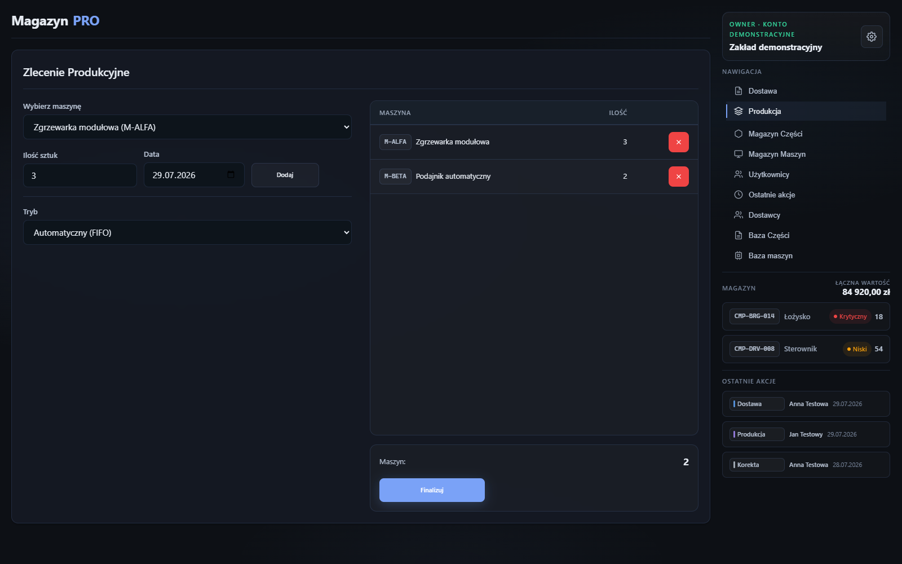
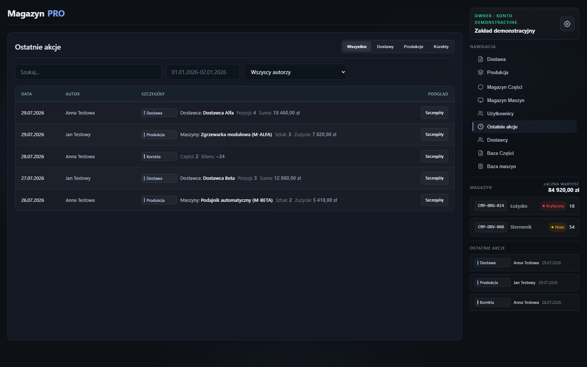
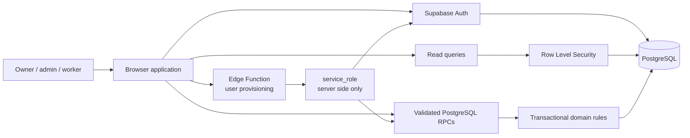

<p align="center">
  
</p>

<h1 align="center">Magazyn PRO</h1>

<p align="center">
  An internal warehouse and production management system developed for a small
  manufacturing business.
</p>

<p align="center">
  <a href="https://michalbursztyn.github.io/magazynpro/">Live application</a>
  ·
  <a href="docs/ARCHITECTURE.md">Architecture</a>
  ·
  <a href="docs/DECISIONS.md">Engineering decisions</a>
  ·
  <a href="SECURITY.md">Security</a>
  ·
  <a href="supabase/WDROZENIE.md">Supabase deployment (PL)</a>
</p>

<p align="center">
  
  
  
  
</p>

> The hosted application requires an authorized company account. Public demo
> credentials are intentionally not stored in this repository.

## What it solves

Magazyn PRO brings the inventory workflow into one consistent system: catalog
management, purchasing, production, stock adjustments, history and company
access control. The UI remains intentionally lightweight, while authorization
and business-critical invariants are enforced in the backend.

| Area | Capabilities |
| --- | --- |
| Inventory | Stock by part and lot, configurable alerts, archive views and controlled adjustments |
| Deliveries | Supplier selection, invoice metadata, per-lot quantities and prices |
| Production | Machine BOMs, shortage detection, FIFO consumption and manual lot allocation |
| Catalogs | Parts, suppliers, supplier prices, machines and BOM definitions |
| Traceability | Delivery, production and adjustment history with actor attribution |
| Administration | Company members, `owner` / `admin` / `worker` roles and configurable permissions |

## Engineering highlights

- Multi-tenant isolation based on authenticated membership and `company_id`.
- PostgreSQL Row Level Security for every relevant business table.
- Validated RPC functions for protected writes; multi-record warehouse
  operations execute transactionally.
- Serialized company operations and optimistic conflict checks protect against
  accidental overwrites.
- FIFO lot consumption with exact consumed-lot history.
- Edge Function user provisioning with JWT validation; the `service_role` key
  never reaches browser code.
- Safe client-side error mapping and guarded rendering of database content.
- No bundler or framework: the browser loads four focused JavaScript modules in
  a fixed order.

## Product tour

All screenshots below come from the real application interface populated only
with synthetic showcase data. No company records or personal data are included.

### Inventory overview



### Production workflow



### Operation history



## Architecture



The browser is not a security boundary. It provides role-aware UX, while RLS,
RPC authorization helpers and the Edge Function independently verify access.
See [the architecture notes](docs/ARCHITECTURE.md) for data flows and trust
boundaries.
The reasoning behind the main technical trade-offs is documented in
[Engineering decisions](docs/DECISIONS.md).

## Run locally

The project has no build step. Serve the repository over HTTP:

```powershell
python -m http.server 8000 --bind 127.0.0.1
```

Then open `http://127.0.0.1:8000/`. Do not use `file://`; browser and Supabase
features require an HTTP origin.

The checked-in browser configuration contains only the publishable Supabase
client key. Secrets such as `SUPABASE_SERVICE_ROLE_KEY` belong exclusively in
Supabase-managed environment variables.

## Verification

Run the dependency-free checks with Node.js 22:

```powershell
node --check app-core.js
node --check app-ui.js
node --check app-supabase.js
node --check app-init.js
node --experimental-strip-types --check supabase/functions/create-company-worker/index.ts
node --test tests/regression.test.js
```

The regression suite covers strict business-value parsing, deterministic lot
ordering, safe error handling, compatibility with existing six-character
passwords, company-context guards, synchronized-write guards, paginated reads,
RPC-only protected writes and backend hardening invariants.

The deployed backend was also verified with the read-only SQL audit
(`8/8` checks passing) and manual flows for authentication, user provisioning,
thresholds, catalogs, deliveries, FIFO production, adjustments, history and
worker restrictions. Cross-company isolation, concurrent-edit conflicts and
network/session failure scenarios remain explicitly tracked as additional
manual verification.

## Repository map

| Path | Responsibility |
| --- | --- |
| `index.html` | Semantic page structure and script loading order |
| `style.css` | Responsive dark UI and component styles |
| `app-core.js` | State, validation and warehouse domain logic |
| `app-ui.js` | Rendering, tables, modals and interaction helpers |
| `app-supabase.js` | Authentication, reads, RPC calls and safe error mapping |
| `app-init.js` | Initialization, event binding and module orchestration |
| `supabase/` | SQL migration, read-only audits and the Edge Function |
| `tests/` | Node.js regression tests |
| `docs/DECISIONS.md` | Technical choices, trade-offs and current limits |
| `CONTRIBUTING.md` | Local workflow and pull request checks |

## Project status

Magazyn PRO is an internal system in pre-production validation for a small
manufacturing business. The application and hardened Supabase backend are
operational; the next quality milestone is automated browser testing with
isolated test tenants.

## Po polsku

Magazyn PRO to wielofirmowa aplikacja do obsługi magazynu części i produkcji.
Pozwala zarządzać katalogami, dostawami, partiami, BOM-em maszyn, produkcją
FIFO, korektami, historią oraz rolami użytkowników. Interfejs jest po polsku,
a krytyczne reguły dostępu i integralności są egzekwowane również w Supabase,
nie tylko w przeglądarce.

---

<sub>Copyright © 2026 Michał Bursztyn. All rights reserved. The source code is
publicly available for evaluation; no license for reuse or redistribution is
granted.</sub>
