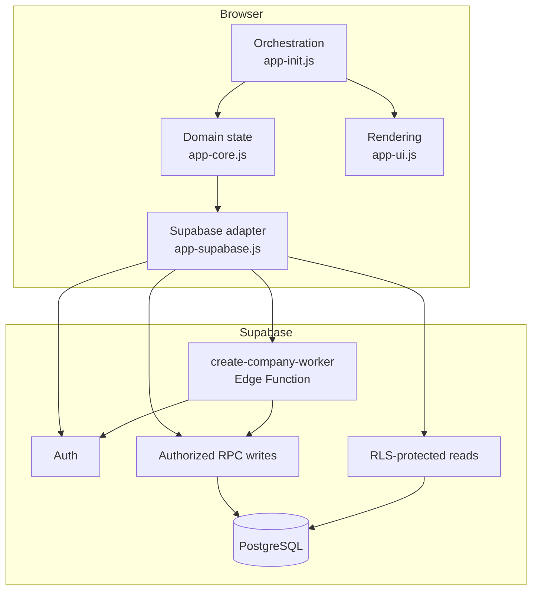
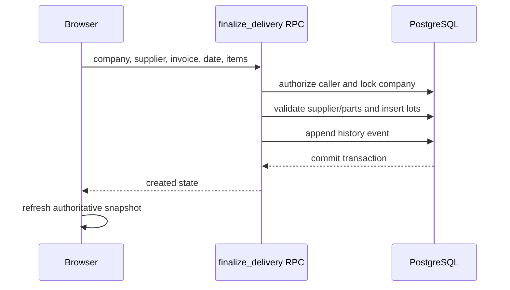

# Magazyn PRO architecture

This document describes the system boundaries and the design decisions that
matter most for correctness and security.

## System overview

Magazyn PRO is a browser application without a compilation step. The frontend
is split into four scripts loaded in this exact order:

1. `app-core.js` — application state, validation and warehouse domain logic,
2. `app-ui.js` — rendering and reusable interaction helpers,
3. `app-supabase.js` — authentication and backend communication,
4. `app-init.js` — initialization, event handlers and orchestration.

Supabase provides authentication, PostgreSQL storage, Row Level Security,
transactional RPC functions and the `create-company-worker` Edge Function.

## Trust boundaries

### Browser

The browser stores UI state and presents only the actions allowed for the
current role. These checks improve usability but do not grant authority. Any
browser payload, including `companyId`, role, quantity or price, is considered
untrusted.

### PostgreSQL

PostgreSQL is the primary authorization and consistency boundary:

- RLS limits reads to an active profile, company and membership.
- Private authorization helpers derive access from `auth.uid()`.
- Protected catalog and settings writes are exposed only through validated
  RPCs.
- Warehouse operations use transactions and company-scoped advisory locks.
- Constraints and indexes enforce value ranges, relationships and
  case-insensitive uniqueness.

### Edge Function

The Edge Function provisions users because this operation requires the Auth
Admin API. It verifies the caller's JWT and active owner membership, derives
the effective company on the server and invokes a service-role-only
provisioning RPC. `SUPABASE_SERVICE_ROLE_KEY` is read only from the function
environment.

## Critical write paths

### Delivery

### Production

The production RPC validates the machine definition and BOM, calculates or
checks lot allocations, prevents negative stock, consumes parts and creates
machine stock in one transaction. Exact lot usage is persisted for
traceability.

### Stock adjustment

Adjustments validate quantities and permissions, update the selected lots and
append an attributed history event atomically.

### Catalog and company settings

Parts, suppliers, supplier prices, machines, BOM definitions and company
thresholds are changed through dedicated RPCs. Direct browser mutation
privileges are revoked for protected tables.

## Domain invariants

- Inventory quantities are finite non-negative integers.
- Prices are finite non-negative values within backend limits.
- Production cannot consume more stock than is available.
- Manual allocations cannot introduce parts outside the machine BOM.
- FIFO ordering is deterministic, including text-based lot identifiers.
- Every business operation stays within the authorized company.
- Historical operations record their author and relevant lot relationships.
- Archived catalog records are preferred over deleting referenced history.
- A stale or incomplete client snapshot cannot initiate a business write.

## Failure handling

Remote writes complete before local state is treated as durable. If the
operation succeeds but the refresh fails, the UI reports that the server write
was completed and asks for a refresh instead of replaying the operation
silently. Backend errors are mapped to safe messages; raw SQL details and
internal identifiers are not shown to users.

## Verification layers

| Layer | Check |
| --- | --- |
| JavaScript | `node --check` for all four browser modules |
| Edge Function | Node TypeScript syntax check |
| Regression | Dependency-free `node:test` suite |
| Pre-deployment | Read-only SQL data preflight |
| Post-deployment | Read-only RLS, privilege, helper, index and RPC audit |
| Manual | Auth, roles, catalogs and warehouse workflows |

Operational deployment details are documented in
[`supabase/WDROZENIE.md`](../supabase/WDROZENIE.md).
